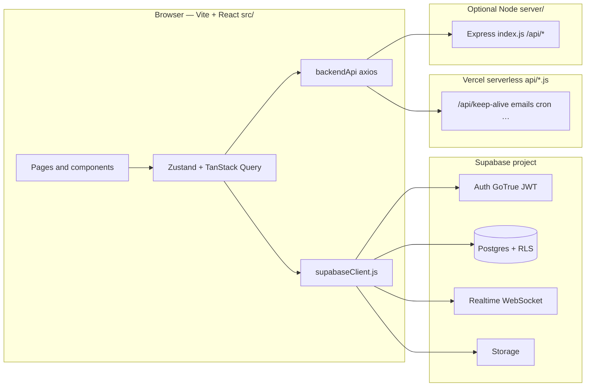
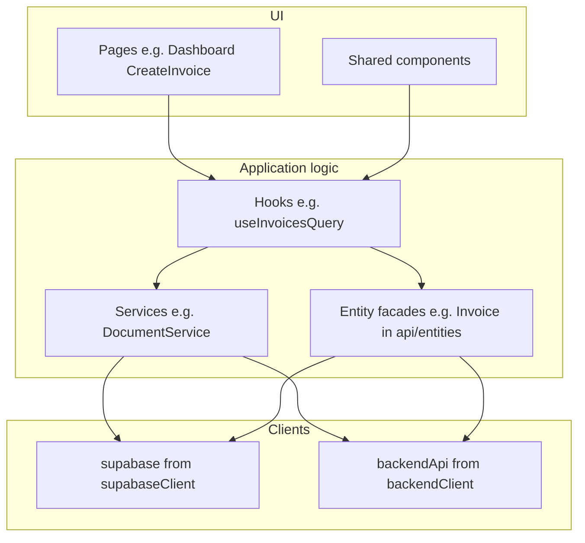
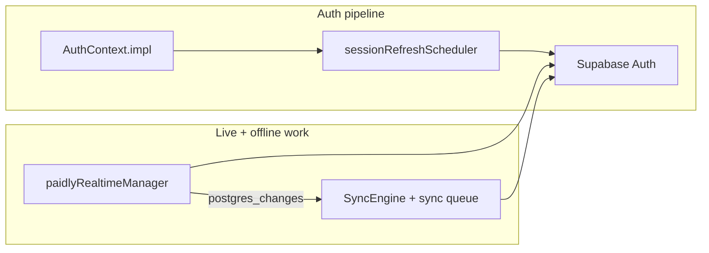

# How everything connects (start here)

One-page map of **who talks to whom**. Use the links at the bottom when you need depth.

---

## 1. The big picture (three legs from the browser)

Your **React app** (in `src/`) runs in the user’s browser. From there, traffic goes to **three** different kinds of backends — they are **not** the same server.

| Leg | Typical use | Config |
|-----|-------------|--------|
| **Supabase** (`supabaseClient.js`) | Sign-in, CRUD on tables, Realtime, file uploads | `VITE_SUPABASE_URL`, `VITE_SUPABASE_ANON_KEY` |
| **Same-origin `/api`** (Vercel) | Emails, cron, keep-alive rewrite, etc. | No `VITE_SERVER_URL` → hits your deployed site’s `api/` |
| **Separate API host** (Express) | Same `/api` paths but on another origin | `VITE_SERVER_URL` → `server/src/index.js` |

**Important:** Rate limits and middleware on **Express** do **not** apply to traffic that only hits **Vercel `api/*.js`**. See [API_DEPLOYMENT_MODEL.md](./API_DEPLOYMENT_MODEL.md).

---

## 2. Inside the app (how UI reaches data)

- **Hooks / services** own orchestration (fetching, retries, cache keys).
- **Entities** (`src/api/customClient.js` + `entities.js`) map product objects to **Supabase tables** and enforce things like **`org_id`** on writes.
- **Auth** is centralized in **`AuthContext`** + **`sessionRefreshScheduler`** so refresh and “am I logged in?” stay coherent.

---

## 3. Session, sync, and live updates (how it feels “connected”)

- **Realtime** listens to DB changes and nudges caches / invalidation.
- **Sync queue** (`useSyncQueueStore`) holds work like “create invoice” and **`SyncEngine`** runs it when the session is ready.
- **Connection lifecycle** ties together network, visibility, refresh, and Realtime so one flaky Wi‑Fi blip does not randomly mean “logged out” if recovery succeeds. Details: [CONNECTION_LIFECYCLE_ARCHITECTURE.md](./CONNECTION_LIFECYCLE_ARCHITECTURE.md).

---

## 4. Where “truth” lives

| Concern | System of record |
|--------|-------------------|
| Users, orgs, invoices, clients, … | **Supabase Postgres** (RLS enforces who sees what) |
| Signed-in session (JWT + refresh) | **Supabase Auth** (persisted in browser storage via `supabaseClient`) |
| Pending offline / deferred writes | **Browser** `localStorage` sync queue (per device) |
| Product direction & system names | **`docs/Paidly-Application-Blueprint.md`** |

---

## 5. GitHub’s role

**GitHub** holds **source code** and CI — it is **not** in the request path when a user uses the app. Deployments (e.g. **Vercel**) build from GitHub and inject env vars; the running app talks to **Supabase** and **`/api`**, not to GitHub.

---

## Read next (deeper maps)

| Doc | Use when you need… |
|-----|---------------------|
| [PHASE_COMPLETION_STATUS.md](./PHASE_COMPLETION_STATUS.md) | Runtime initiative checklist (phases 1–10) |
| [runtime-audit-report.md](./runtime-audit-report.md) | Phase-1 risks across auth, realtime, query, sync |
| [architecture-improvement-plan.md](./architecture-improvement-plan.md) | Phased adoption of `src/core/*` |
| [Paidly-Application-Blueprint.md](./Paidly-Application-Blueprint.md) | Product systems, strategy, data-flow story |
| [ARCHITECTURE_RUNTIME_MAP.md](./ARCHITECTURE_RUNTIME_MAP.md) | Browser vs Supabase vs edge ownership |
| [API_DEPLOYMENT_MODEL.md](./API_DEPLOYMENT_MODEL.md) | Which `/api` runs where (Vercel vs Express) |
| [API_RATE_LIMIT_BUDGET.md](./API_RATE_LIMIT_BUDGET.md) | Keep-alive + Axios vs rate limits |
| [Paidly-Caching-Architecture.md](./Paidly-Caching-Architecture.md) | Query persistence, prefetch, cache layers |
| [SESSION_RUNTIME_GUARDS.md](./SESSION_RUNTIME_GUARDS.md) | Auth vs transport incident playbooks |

If you want this as a **printable one-pager**, export this file to PDF from your editor or use the blueprint PDF workflow your team already uses.
