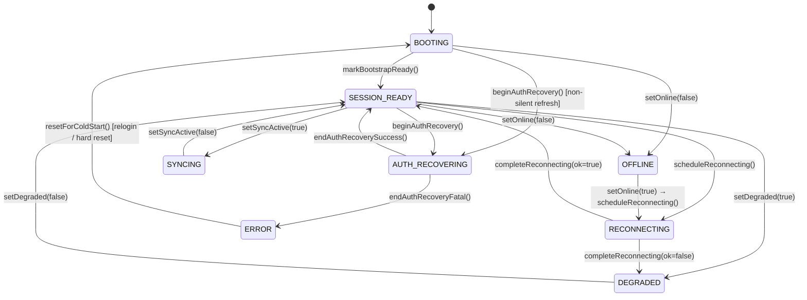
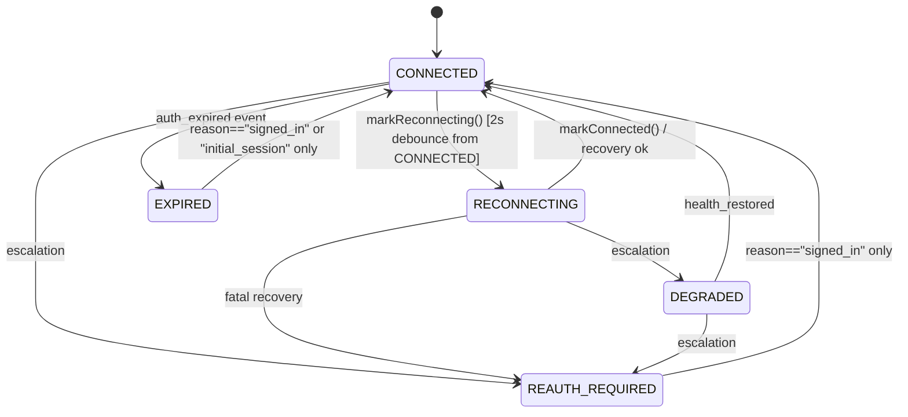

# Paidly — Runtime State Diagrams

> Updated: 2026-05-18. Reflects `RuntimeCoordinator.ts`, `sessionHealthStore.js`, `paidlyRealtimeConnectionMachine.js`, and `WakeRecoveryPipeline.js`.

---

## 1. RuntimeCoordinator (request pausing + auth recovery)

Source: `src/core/runtime/RuntimeCoordinator.ts`  
Fed by: `src/core/runtime/runtimeCoordinatorBridge.js` ← `ConnectionLifecycleManager`



**`pauseNonCriticalRequests = true`** when phase ∈ `{BOOTING, AUTH_RECOVERING, RECONNECTING}`.  
`RequestCoordinator.waitUntilUnpaused()` blocks new HTTP slots until this clears (event-driven via Zustand subscription).

**Bridge signal mapping** (`runtimeCoordinatorBridge.js`):

| CLM signal | RuntimeCoordinator action |
|------------|--------------------------|
| `mark_connected` | `completeReconnecting(true)` or `endAuthRecoverySuccess()` or `setPhase("SESSION_READY")` |
| `mark_reconnecting` | `scheduleReconnecting()` |
| `network_state(online=false)` / `report_offline` | `setOnline(false)` |
| `network_state(online=true)` | `setOnline(true)` |
| `report_refresh_starting` (non-silent only) | `beginAuthRecovery()` |
| `report_refresh_ok` | `endAuthRecoverySuccess()` if in AUTH_RECOVERING |
| `mark_manual_logout_reset` | `resetForColdStart()` |

---

## 2. Session Health State Machine (UI state)

Source: `src/stores/sessionHealthStore.js`  
Authority: `createSessionOrchestrator` via `applySessionHealthFromAuthority()`



**Guards:**
- `EXPIRED` → any non-terminal state: **blocked** unless `reason ∈ {"signed_in", "initial_session"}`
- `REAUTH_REQUIRED` → `CONNECTED`: **blocked** unless explicit re-auth reason
- `RECONNECTING` from `CONNECTED`: **debounced 2s** (suppresses flicker on transient tokens events)

This state drives `SessionIndicator`, `WakeRecoveryOverlay`, and `isRecoveryCircuitOpen()`.

---

## 3. Realtime Channel Connection Machine

Source: `src/lib/realtime/paidlyRealtimeConnectionMachine.js`  
Managed by: `paidlyRealtimeManager.js`

```
  IDLE ─── listeners registered ───▶ CONNECTING
  CONNECTING ─── subscribe(SUBSCRIBED+joined) ──▶ CONNECTED
  CONNECTING ─── subscribe(error/timeout) ───────▶ FAILED
  CONNECTED ─── subscribe error / watchdog ───────▶ FAILED
  STALE ─── heartbeat detects not-joined ──────────▶ RECONNECTING
  FAILED ─── error recovery timer ────────────────▶ RECONNECTING
  RECONNECTING ─── rebuild starts ─────────────────▶ CONNECTING
```

**Reconnect suppression layers** (evaluated in order on every rebuild attempt):

| Layer | Condition | Suppresses for |
|-------|-----------|----------------|
| Auth circuit | `isRecoveryCircuitOpen()` | Until re-auth |
| Browser offline | `navigator.onLine === false` | Until `online` event |
| Realtime circuit breaker | 5 consecutive failures | 120s |
| Transport burst cooldown | 4 subscribe failures in 12s | 35s |
| Hard rate suppress | 10 rebuilds in 90s window | 90s |
| `rebuildInFlight` | Subscribe callback pending | Until callback or watchdog (20s) |
| Rebuild min interval | `< 1.4s` since last rebuild | Until interval elapses |

**Bypass origins:** JWT-refresh and transport-cooldown-end skip all layers except auth circuit and browser offline.

---

## 4. Wake Recovery Pipeline

Source: `src/lib/session/WakeRecoveryPipeline.js`

```
  Tab visible (gap > threshold OR bfcache restore)
       │
       ├─ isRecoveryCircuitOpen()? → skip
       ├─ wakeRecoveryInFlightRef? → skip
       ▼
  AppRecoveryLock.begin("wake_recovery") + blockMutations = true
       │
  ┌────▼──────────┐    ok    ┌──────────────────┐    ok    ┌───────────────┐
  │  auth phase   │─────────▶│  realtime phase   │─────────▶│ resync phase  │
  │  refreshToken │          │  awaitMainChannel │          │ refreshUser   │
  └───────┬───────┘          └────────┬──────────┘          └───────┬───────┘
          │ !ok                       │ !ok                          │ ok
          ▼                           ▼                              ▼
       FAILED ──────────────────── FAILED                 AppRecoveryLock.end()
          │                                               blockMutations = false
          └───▶ reconnectEscalationController.schedule()  SUCCEEDED lifecycle event
```

During recovery: realtime `postgres_changes` events are **silently dropped** by `recoveryLockBlocksRealtimeDelivery()`.

---

## 5. Sync Queue State Machine

Source: `src/stores/useSyncQueueStore.js`

```
  addToQueue() [with optional conflictKey merge]
       │
       ▼
  ┌─────────┐  processNext()  ┌────────────┐   success   ┌──────┐
  │ pending │───────────────▶│ processing │────────────▶│ done │ (trimmed > 40)
  └────┬────┘                 └──────┬─────┘             └──────┘
       │                             │ error
       │                     ┌───────▼──────────────┐
       │                     │ attempts < maxRetries  │
       │                     │ → pending + backoff    │
       │◀────────────────────┤ else → failed          │
       │                     └────────────────────────┘
       │                             │ retryAllFailed() / retryJob()
       │◀───────────────────────────-┘
```

**On mount** (SyncEngine): `resetStuckJobs()` resets `"processing"` → `"pending"` (crash recovery).  
**On login** (SyncEngine): `pruneJobsNotForUser(userId)` removes cross-user jobs.  
**Backoff:** `min(60_000, 2000 × 2^(attempts−1))` ms.

---

## Reconnect Backoff Curves

`RuntimeCoordinator.scheduleReconnecting()` — exponential from 400ms, cap 30s:

| Attempt | Delay |
|---------|-------|
| 0 | 400ms |
| 1 | 800ms |
| 2 | 1.6s |
| 3 | 3.2s |
| 4 | 6.4s |
| 5 | 12.8s |
| 6+ | 30s (cap) |

`paidlyRealtimeManager` error-recovery backoff — 5-step discrete:

| Step | Delay |
|------|-------|
| 0 | 1s |
| 1 | 2s |
| 2 | 5s |
| 3 | 10s |
| 4+ | 30s (cap) |
