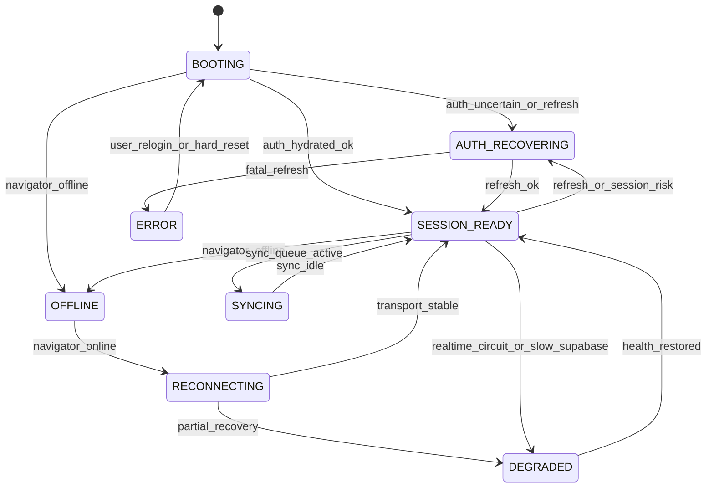

# Runtime state diagram

Canonical phases for **`RuntimeCoordinator`** (`src/core/runtime/RuntimeCoordinator.ts`).

## State machine (Mermaid)

## Orthogonal axes (conceptual)

The coordinator **compresses** multiple booleans into one **phase** for UI + policy, while still allowing internal flags:

| Axis | Source of truth (today → target) |
|------|----------------------------------|
| Auth JWT validity | Supabase client + `AuthContext` → feed **RuntimeCoordinator** |
| Network | `navigator.onLine` + fetch errors → **OFFLINE / RECONNECTING** |
| Realtime transport | `paidlyRealtimeManager` → **DEGRADED** when circuit open |
| Sync | `useSyncQueueStore` → **SYNCING** when pending/processing |

## Tab / multi-tab

- **Single coordinator instance per tab** (Zustand store module singleton).
- Cross-tab: reuse existing **`authTabSync`** / storage locks; coordinator listens to duplicated signals but **debounces** transitions.

## Reconnect backoff

`scheduleReconnecting()` waits **`reconnectDelayMs(reconnectAttempt)`** — exponential from **`RECONNECT_DEBOUNCE_MS`** (400ms) up to a **30s cap**, with the attempt counter incremented on **`completeReconnecting(false)`** and cleared on success or when entering **OFFLINE** (fresh backoff curve after a real outage).
