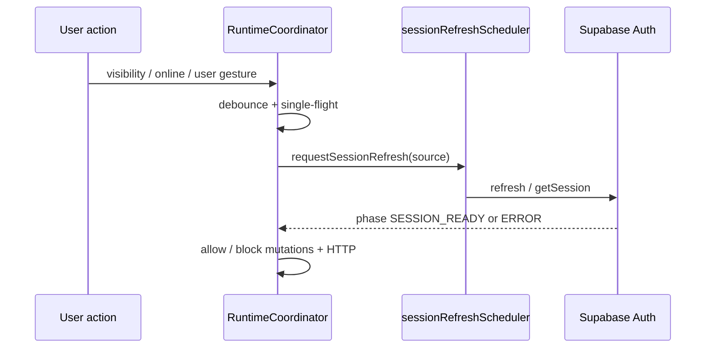

# Session recovery flow

## Separation of concerns

| Class | Examples | User-facing |
|-------|----------|-------------|
| **Transport** | WebSocket closed, 503, DNS flake | “Reconnecting…” (degraded) |
| **Auth** | Invalid refresh, MFA required | “Sign in again” (terminal) |
| **Data** | RLS 42501, stale JWT on REST | “Refresh” / toast |

**Rule:** transport failures **must not** call `signOut` unless orchestrator proves auth is terminal.

## Existing orchestration (reference)

- **`sessionRefreshScheduler`** — single queue for refresh work (`src/lib/session/sessionRefreshScheduler.js`)
- **`ConnectionLifecycleManager`** — ingress for lifecycle signals (`src/lib/connection/ConnectionLifecycleManager.js`)
- **`supabaseAuthRefresh`** — lock + freshness guard (`src/lib/supabaseAuthRefresh.js`)
- **Wake recovery** — blocks mutations until auth+realtime healthy (`WakeRecoveryPipeline.js`)

## Target flow with `RuntimeCoordinator`

## Hardening checklist

- [ ] All refresh initiators use **`requestSessionRefresh`** (grep for raw `refreshSession`).
- [ ] No **parallel** `supabase.auth.refreshSession()` outside `supabaseAuthRefresh` single-flight.
- [ ] **429** from Auth endpoint → backoff, not fatal unless message indicates revoked token.
- [ ] **Org cache** cleared on identity change (`clearSessionOrgIdCache` in `AuthContext`).
